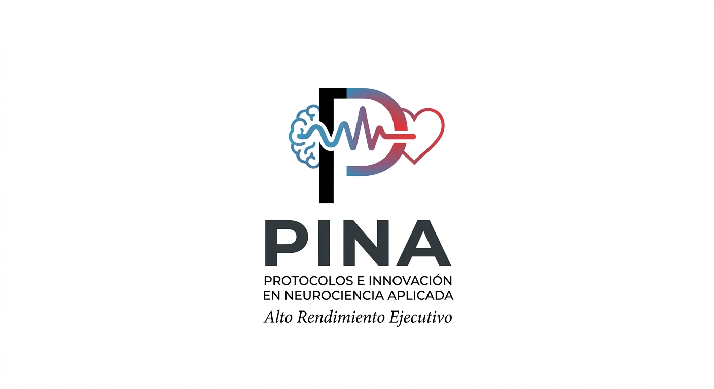

# PinaBio Paca v2.0 beta — documentation and KiCad prototype

[Español](README.md)

This documentation defines a protected 1S LiPo, a BQ24074 and a TPS63070 at 3.3 V and a 3.0 V LDO only for the temperature sensor. With the switch OFF and USB connected, the battery charges and the ESP32 can be programmed. With the switch ON and USB connected, the BQ24074 standby mode leaves the system powered from the battery and stops charging. USB can carry data; a host-powered external USB isolator is required whenever a person is connected.

The board is designed to acquire ECG, PPG, GSR, two respiration bands, local temperature and battery voltage. It is an experimental biofeedback design, not a medical device.

## Documentation

- [KiCad 9 project "PinaBio-v2.0-ChatGPT"](hardware/PinaBio-v2.0-ChatGPT/README.en.md) — schematic, routed PCB, BOM and ERC/DRC reports; **prototype awaiting validation, with no manufacturing Gerbers released**.
- [KiCad 9 project "PinaBio-v2.0-Cursor"](hardware/cursor/PinaBio-v2.0-Cursor/README.md) — the same board to `SPEC-0.9` / `PWR-0.7`, with the U.FL antenna at the edge and the split ground.
- [Hardware specification (EN)](docs/en/specification.md)
- [Power and USB (EN)](docs/en/power-usb.md)
- [Protocol (EN)](docs/en/protocol.md)
- [V1 comparison (EN)](docs/en/v1-comparison.md)
- [Especificación de hardware (ES)](docs/es/especificacion.md)
- [Alimentación y USB (ES)](docs/es/alimentacion-usb.md)
- [Protocolo BLE y datos (ES)](docs/es/protocolo.md)
- [Comparación V1/V2 (ES)](docs/es/comparacion-v1.md)
- [Registro de revisión (ES)](docs/es/revision-diseno.md)

Before manufacture, the actual breakouts, schematic, footprints, PCB, body-connected paths and specified electrical tests must be independently verified. Sensor connectors have no automatic disconnect; USB during acquisition with a person requires an external isolator.
