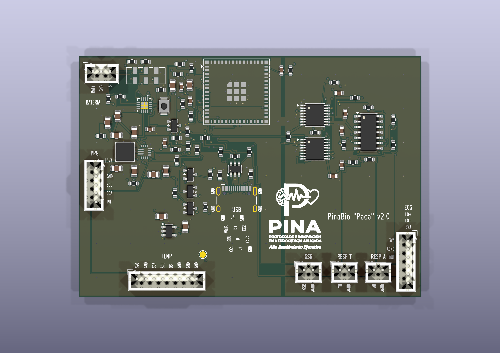

## Conector de batería (J2)

1. Pin 1: positivo de la batería. Cable rojo. Va al cargador.
2. Pin 2: negativo. Cable negro. Masa.
3. Pin 3: sensor de temperatura que trae la batería. No es alimentación. El cargador deja de cargar si la pila está demasiado caliente o demasiado fría.

El pin 1 es el extremo marcado del conector JST. La batería tiene que ser una LiPo protegida con ese tercer cable. Si el conector del pack no trae ese orden, cruza los cables: rojo al pin 1, negro al pin 2, sensor al pin 3.

1. El interruptor de la caja es un C&K 7201SYZQE (DPDT ON-ON). La placa deja seis taladros, con ON junto a 1 y 4 y OFF junto a 3 y 6. El cable va de cada taladro al terminal del mismo número.
2. La bobina de 1,5 µH es Coilcraft XAL4020-152ME. El patrón de tierra de la hoja coincide con la huella XAL4020.
3. La masa alrededor del TPS63070 está revisada: las vías de GND y PGND están bien y esa zona no se ha movido.

En el modulo de temperatura, unir A0, A1 y A2 a masa. El mazo del ECG cruza alimentacion con masa, y LO+ con LO-. El del pulso y el de temperatura pueden ir rectos. Eso ya esta escrito en la carpeta de la placa.

# PinaBio Paca v2.0 beta — documentación y prototipo KiCad

[English](README.en.md)

Este conjunto define una LiPo 1S con BQ24074, un TPS63070 a 3,3 V y un LDO de 3,0 V solo para el sensor de temperatura. Con el interruptor OFF y USB conectado se carga la batería y se permite programar. Con ON y USB, el modo standby del BQ24074 deja el sistema alimentado por la batería y detiene la carga; USB transporta datos, y requiere un aislador externo alimentado desde el host cuando haya una persona conectada.

La placa registra ECG, PPG, GSR, dos bandas respiratorias, temperatura local y batería. Es un diseño experimental de biofeedback, no un dispositivo médico.

## Documentación

- [Proyecto KiCad 9 «PinaBio-v2.0-ChatGPT»](hardware/PinaBio-v2.0-ChatGPT/README.md) — esquemático, PCB enrutada, BOM e informes ERC/DRC; **prototipo pendiente de validación, sin Gerbers liberados para fabricación**.
- [Proyecto KiCad 9 «PinaBio-v2.0-Cursor»](hardware/cursor/PinaBio-v2.0-Cursor/README.md) — la misma placa según `SPEC-0.9` / `PWR-0.7`, con la antena U.FL en el borde y la masa partida.
- [Especificación de hardware (ES)](docs/es/especificacion.md)
- [Alimentación y USB (ES)](docs/es/alimentacion-usb.md)
- [Protocolo BLE y datos (ES)](docs/es/protocolo.md)
- [Comparación V1/V2 (ES)](docs/es/comparacion-v1.md)
- [Registro de revisión (ES)](docs/es/revision-diseno.md)
- [Hardware specification (EN)](docs/en/specification.md)
- [Power and USB (EN)](docs/en/power-usb.md)
- [Protocol (EN)](docs/en/protocol.md)
- [V1 comparison (EN)](docs/en/v1-comparison.md)

Antes de fabricación son obligatorios: revisión independiente de huellas y esquema, verificación de cada breakout, comprobación de las rutas hacia el cuerpo y los ensayos eléctricos descritos en la especificación. Los conectores de sensores no llevan cortes automáticos; para USB durante la adquisición con una persona se exige un aislador externo.
