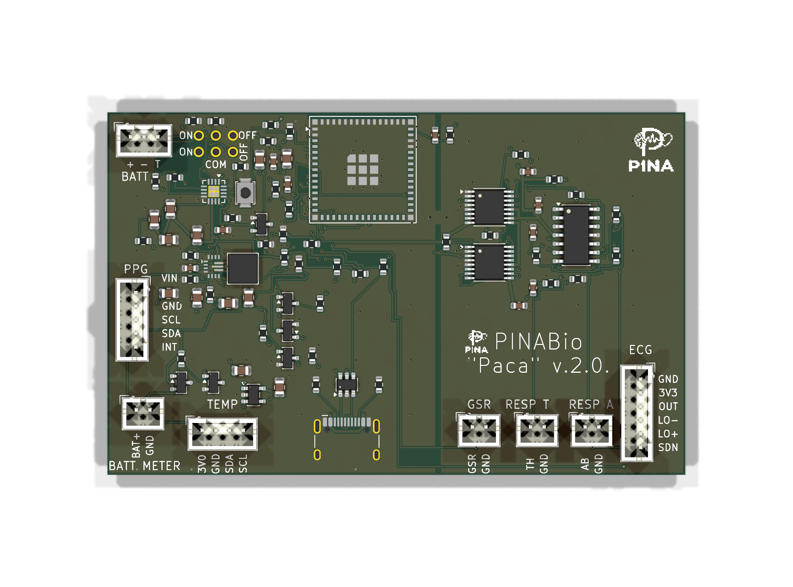

# PINABio "Paca" v.2.0.

[Español](README.md) · [Full specification](../../docs/en/specification.md) · [Power and USB](../../docs/en/power-usb.md)

Editable **KiCad 9.0.9** project, four layers, **84.50 × 53.11 mm**. It implements the project's fixed architecture: one soldered USB-C, physical-switch-controlled BQ24074 standby, no VBUS cut-off MOSFET, two regulators, no automatic sensor disconnects or new I²C pull-ups, two ground regions joined only at NT1, and a copper keepout on all layers beneath the ESP32 U.FL end. The TPS63070 and inductor keep SW_L1 and SW_L2 entirely on F.Cu at 0.40 mm with no vias; the RNM footprint retains pin 1 at top left and counterclockwise numbering.

## Files and checks

- `PinaBio-Paca-v2.0.kicad_sch`, `.kicad_pcb`, `.kicad_pro`: editable schematic and PCB.
- `PinaBio.kicad_sym`, `lib.pretty/`, `sym-lib-table`, `fp-lib-table`: required libraries.
- `bom.csv`: parts list with manufacturer part numbers. L1 is **Coilcraft XAL4020-152MEC**.
- `fab/`: four-layer copper, mask, paste, silkscreen and outline Gerbers; separate PTH/NPTH drill files; `position.csv` in millimetres. `PinaBio-Paca-v2.0-Gerbers.zip` bundles the 14 board and drill files for fabrication upload; BOM and placement are separate.
- `final-erc.txt`, `final-parity.txt`: **ERC 0, DRC 0, 0 unrouted connections and schematic/PCB parity 0**, checked with KiCad 9.0.9.
- `Logo PINA-reducido.jfif`: source image converted to one-colour board silkscreen.

These Gerbers are **prototype outputs**. Before fabrication or assembly, independently check footprints against purchased parts and test one assembled unit, particularly USB-C and TPS63070 orientation, ON/OFF/USB transitions and external-module wiring.

## Connector map

| Ref | Pins in order |
|---|---|
| J1 | HCTL HC-TYPE-C-16P-01A USB-C at lower edge; D+ and D− via USBLC6-2SC6 and 22 Ω series resistors. |
| J2 BATT | 1 protected BAT+, 2 GND, 3 TS/NTC. Three-pin JST PH. The silkscreen says “BATT” below the connector. |
| J3 ECG | 1 AGND, 2 3V3_A, 3 ECG_OUT, 4 LO_N, 5 LO_P, 6 3V3_A (SDN permanently enabled). Matches the red module order GND, 3.3V, OUTPUT, LO−, LO+, SDN. |
| J4 PPG | 1 3V3_SYS/VIN, 2 GND, 3 SCL, 4 SDA, 5 INT. “VIN” identifies module power; the other four signals are labelled by their pins. |
| J5 TEMP | 1 3V0_TEMP, 2 GND, 3 SDA, 4 SCL. Four-pin JST PH; tie A0/A1/A2 to GND on the CJMCU-30205 module. |
| J6 GSR | 1 GSR signal, 2 AGND. |
| J7 RESP T | 1 chest signal, 2 AGND. |
| J8 RESP A | 1 abdominal signal, 2 AGND. |
| J9 BATT METER | 1 switched BAT+, 2 GND. JST PH B2B-PH-K-S(LF)(SN), reserved for the battery meter. |

J9 is live only while **3V3_SYS** is active (ON with battery, or OFF with USB). Q4 BSS84 and Q5 BSS138 form the high-side switch; Q4 has 1 MΩ gate-to-source. J9 is not a general power output.

## Switch and power

SW1 is **six cable holes**, not a footprint for soldering the switch. The reference panel part is C&K **7201SYZQE**, DPDT ON-ON. Another six-terminal DPDT ON-ON part, such as an MTS-202, may be used after checking its common terminals and contact states with a meter. Hole 1–6 numbering follows C&K terminal 1–6: 1 VLOG, 2 EN2_CE, 3 GND, 4 BAT_PROT, 5 TPS_EN, 6 VLOG.

R39, **10 kΩ, 1 %**, sits close to TPS63070 EN, between TPS_EN and TPS_EN_IC. R12, 100 kΩ, stays on the switch side. PS/SYNC is tied to ground for forced PWM. TLV75530PDBVR supplies **only** the temperature module at 3.0 V. VBUS link R3 remains **0 Ω**.

With OFF and USB attached, the battery charges and the board may be programmed. With ON and USB attached, BQ24074 is in standby: the LiPo runs the board, USB carries data, and charging stops. A suitable external USB isolator is required before connecting a person in that state. The PCB has no onboard isolation or automatic sensor disconnect.
