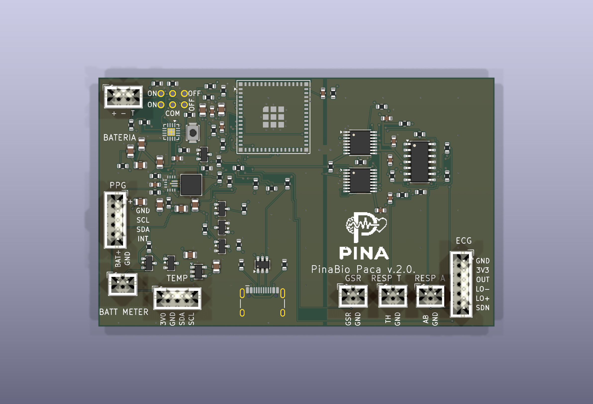

> La imagen anterior muestra la versión ChatGPT derivada de este diseño. El proyecto Cursor conservado en esta carpeta mantiene su propia PCB y sus archivos de fabricación originales.

# PinaBio v.2.0. Cursor

Diseño de competición en KiCad 9.0.9, solo con lo que queda escrito en SPEC-0.9 / PWR-0.7. Los sensores van a sus conectores sin relé, MOSFET ni conmutador en serie. El aislador USB es externo, en el cable. El BQ24074 entra en standby con el interruptor (EN1, EN2 y CE); no hay MOSFET de corte de VBUS.

Placa 80,99 × 56,90 mm, cuatro capas. F.Cu e In1.Cu parten la masa en dos zonas: digital (ESP32, USB, BQ24074, TPS63070) y analógica (ADS122C04, MCP6004, divisor de ECG, GSR y bandas). Se unen en un solo sitio, corto y ancho, en NT1, junto a los ADS y a R15 (0 Ω entre 3V3_SYS y 3V3_A). In2.Cu es 3V3_SYS y no lleva señales de datos. B.Cu lleva las señales. Las señales analógicas no cruzan la masa digital.

El módulo es un ESP32-S3-MINI-1U: no tiene antena impresa, tiene conector U.FL. Ese extremo queda en el borde superior. En todas las capas, bajo ese extremo y un poco más allá del módulo, hay un keepout sin cobre, pistas, vías ni plano. El USB y el buck no están bajo esa zona. La huella oficial que coincide con el patrón se llama `RF_Module:ESP32-S2-MINI-1U`.

## Comprobaciones

| Informe | Resultado |
| --- | --- |
| `erc.rpt` | 0 errores, 0 avisos |
| `drc.rpt` | 0 errores, 0 avisos, 0 sin conectar |

El DRC incluye errores y avisos. No queda ninguno. `kicad-cli pcb drc --schematic-parity` queda en 0 avisos. `fp-lib-table` y `sym-lib-table` usan `${KIPRJMOD}` y `${KICAD9_SYMBOL_DIR}`: el ERC da 0 en un clon limpio.

`fab/` tiene los Gerber (cobre, máscara, pasta, serigrafía y contorno), los Excellon PTH y NPTH, los mapas de taladro y `position.csv` en milímetros.

## Lo que cambia en SPEC-0.9

- R35 y R36 son 22 Ω en serie con D− (GPIO19) y D+ (GPIO20), entre el USBLC6-2SC6 y el ESP32.
- U1 es un USBLC6-2SC6. La huella sigue siendo SOT-23-6, no SOT-666.
- R37 es 46,4 kΩ al 1 % de TMR (pin 14 del BQ24074) a masa. ITERM sigue en el pin 15.
- SW_L1 y SW_L2 van enteros en F.Cu, a 0,40 mm, sin vía. L1 está al este de U3 (U3 a 0°) y los dos nodos miden 2,30 y 2,43 mm de pista.
- R38 es 10 kΩ de GPIO0 a 3V3_SYS. El pulsador de BOOT sigue llevando GPIO0 a masa.
- C12 y C13, los 2,2 µF del TLV75530, son X7R 0805.

## Huellas que no están en la biblioteca oficial

- `lib.pretty/TPS63070RNM.kicad_mod`: patrón de tierra del encapsulado RNM (VQFN-HR de 15 pines) según el dibujo 4222000/B de TI, en SLVSC58B, visto desde arriba: pin 1 arriba a la izquierda y numeración antihoraria (1–4 columna izquierda, 5–8 fila inferior, 9–11 columna derecha de abajo arriba, 12–15 fila superior de derecha a izquierda). Pads de señal 0,25 × 0,60 mm (columna izquierda en x = −1,175 mm); pines 7, 8, 12 y 13 de 0,35 × 0,70 mm; pines 9 (L2) y 11 (L1) de 1,45 × 0,35 mm y pin 10 (PGND) de 1,80 × 0,35 mm. Sin thermal pad. El cheurón de serigrafía está fuera de la máscara, junto al pin 1. Una versión anterior tenía la numeración en espejo y los pines 9–11 de 1,25 × 0,25 mm; está corregida (véase `rework_tps63070.py`).
- `lib.pretty/GndTie_2mm.kicad_mod`: el único puente entre GND y AGND. Cobre corto y ancho en F.Cu y en In1.Cu, con dos taladros. No entra en el BOM ni en el fichero de posición.
- Símbolo `ADS122C04` en `PinaCursor.kicad_sym`: patillaje TSSOP-16 PW de SBAS751B, figura 69. Huella oficial `Package_SO:TSSOP-16_4.4x5mm_P0.65mm`.

El resto sale de las bibliotecas de KiCad 9. TLV75530, MCP6004, BSS138, BSS84 y USBLC6-2SC6 son alias del símbolo padre de la biblioteca. Los conectores de sensor y de batería son JST PH de la serie B. J5 (J_TEMP, módulo externo CJMCU-30205) es un JST PH de 4 pines, `JST_PH_B4B-PH-K_1x04_P2.00mm_Vertical`: 3V0_TEMP, GND, SDA_MOD, SCL_MOD. A0, A1 y A2 del módulo se unen a GND en el propio módulo (estaño o hilo corto) y la dirección I²C sigue siendo 0x48. OS del módulo queda sin conectar (el módulo lleva su pull-up de 10 kΩ): no hay red OS, ni punto de prueba, ni GPIO. La bobina de 1,5 µH es Coilcraft XAL4020-152ME, huella `Inductor_SMD:L_Coilcraft_XAL4020-XXX`. El patrón de la hoja XAL4000 (documento 806) mide 2,37 mm entre centros de pad y pads de 0,98 × 3,4 mm, igual que esa huella. No es un XFL4020.

## Reglas de la placa

- Separación de cobre 0,15 mm, pista mínima 0,15 mm, vía 0,50 / 0,25 mm (anillo 0,125 mm).
- El grosor mínimo de los planos es 0,10 mm, por debajo de ese anillo, para que las vías cosan F.Cu con In1.
- Separación agujero–cobre 0,15 mm. Con 0,20 mm no pasa la huella oficial USB-C HCTL: sus taladros de posición quedan a 0,185 mm de los pads de carcasa. No se ha editado esa huella.
- Separación cobre–borde 0,30 mm. Taladro mínimo de vía 0,25 mm.

## Lo que la spec no numera

Estos valores no están en la spec; no son corrientes de módulo:

- R22, R25, R26 y R27 son 10 kΩ (habilitación de módulo y pull-up de interrupciones / DRDY). R38, también 10 kΩ, sí está en la spec: es el pull-up de GPIO0.
- Los 100 nF de desacoplo del op-amp y de los buses.
- R3 es 0 Ω en serie con VBUS: la spec no da el valor de un fusible, y este puente no abre VBUS.
- R15 es 0 Ω entre 3V3_SYS y 3V3_A. Es el mismo buck, no un segundo regulador. Está al lado de NT1.
- GPIO4 = SDA y GPIO5 = SCL del bus de los ADS. GPIO8 = SDA y GPIO9 = SCL de los módulos.

`rework_tps63070.py` (con `rw_router.py`) parte de la placa anterior, cambia U3 por la huella corregida, recoloca L1, C11, R8, R13 y R14 y vuelve a rutear solo la zona del TPS63070. `gen_pcb.py` lleva las mismas posiciones de U3 y L1.

`rework_j5_4pin.py` parte de la placa anterior (J5 de 8 pines con OS y TP1), cambia J5 por la huella de 4 pines, quita TP1, el cobre de OS y las etiquetas de serigrafía de los pines 5 a 8, centra el rótulo TEMP y rellena las zonas. El resto de la placa no se toca.

`rework_sw_pads.py` quita el interruptor de la placa y deja seis taladros (`lib.pretty/SW_ext_6pad.kicad_mod`) en el mismo sitio. La pieza de la caja es un C&K 7201SYZQE: DPDT de dos posiciones estables (ON-ON), casquillo roscado y seis terminales de soldar. Hoja *7000 Series Miniature Toggle Switches*, https://media.digikey.com/pdf/Data%20Sheets/C&K/7000%20Mini%20Toggle%20Series.pdf (la figura DPDT nombra ese código). No es el JS202011JCQN. Los comunes son los terminales 2 y 5. ON, palanca lejos de la chaveta, cierra 2-1 y 5-4. OFF, palanca hacia la chaveta, cierra 2-3 y 5-6. El cable es 1:1:

| Taladro | Red | Terminal del 7201SYZQE |
| --- | --- | --- |
| 1 | VLOG | 1, throw ON del polo A |
| 2 | EN2_CE | 2, común del polo A |
| 3 | GND | 3, throw OFF del polo A |
| 4 | BAT_PROT | 4, throw ON del polo B |
| 5 | TPS_EN | 5, común del polo B |
| 6 | VLOG | 6, throw OFF del polo B |

ON une EN2_CE con VLOG y TPS_EN con BAT_PROT. OFF une EN2_CE con GND y TPS_EN con VLOG. La serigrafía dice ON junto a los taladros 1 y 4, OFF junto a 3 y 6, y COM sobre la columna de los comunes. Los taladros no entran en el BOM con código de fabricante; el código es el de la pieza de caja. La zona del TPS63070 no se ha vuelto a rutear: SW_L1 y SW_L2 siguen en F.Cu a 0,40 mm, sin vía, y las vías de GND/PGND de U3 se quedan donde estaban.

## Mazos de los módulos

El orden de la placa no se cambia para que el cable vaya recto. El mazo se cablea por nombre de señal.

- PPG, foto GY-30102: VIN, GND, SCL, SDA, INT. Coincide con J4 (3V3, GND, SCL, SDA, INT). El cable puede ir recto.
- ECG, módulo rojo AD8232: J3 es 3V3, masa, salida, LO+, LO−, SDN. El módulo es GND, 3,3 V, OUTPUT, LO−, LO+, SDN. En el mazo se cruzan alimentación con masa, y LO+ con LO−. Salida y SDN van rectos.
- Temperatura: J5 es 3V0, GND, SDA, SCL y puede ir recto. A0, A1 y A2 del CJMCU-30205 se unen a masa en el módulo. OS queda sin cable.
